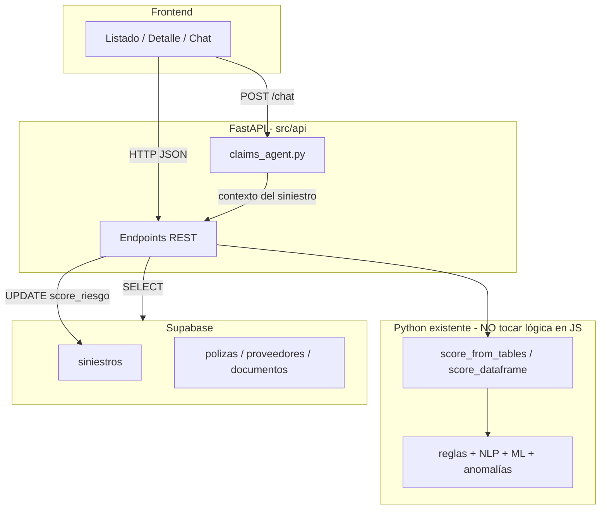

# Guía de integración — Back, Front y Agente (A.U.R.A)

**Audiencia:** desarrollador que arma la aplicación (API, UI, chat con IA).  
**Estado del repo:** el motor de detección de fraude (reglas + ML + NLP + anomalías) **ya está implementado en Python**. Tu trabajo es **conectarlo** a Supabase, exponer REST y construir la interfaz.

Si usas Cursor, Copilot o ChatGPT, **copia las secciones marcadas con “Prompt para IA”** tal cual; están redactadas para que el asistente genere código coherente con este repositorio.

---

## Tabla de contenidos

0. [**¿Es solo un modelo local? Sí, se consume desde el back**](#0-es-solo-un-modelo-local-sí-se-consume-desde-el-back)
1. [Qué es A.U.R.A y qué debes entregar](#1-qué-es-aura-y-qué-debes-entregar)
2. [Qué ya está hecho (no reinventar)](#2-qué-ya-está-hecho-no-reinventar)
3. [Instalación y verificación (15 min)](#3-instalación-y-verificación-15-min)
4. [Arquitectura del sistema](#4-arquitectura-del-sistema)
5. [Base de datos (Supabase)](#5-base-de-datos-supabase)
6. [Motor de scoring (cómo usarlo desde el back)](#6-motor-de-scoring-cómo-usarlo-desde-el-back)
7. [Backend — implementación paso a paso](#7-backend--implementación-paso-a-paso)
8. [Contrato API (especificación completa)](#8-contrato-api-especificación-completa)
9. [Agente conversacional (LLM)](#9-agente-conversacional-llm)
10. [Frontend — pantallas y comportamiento](#10-frontend--pantallas-y-comportamiento)
11. [Plan de trabajo sugerido (3 días)](#11-plan-de-trabajo-sugerido-3-días)
12. [Pruebas y demo del jurado](#12-pruebas-y-demo-del-jurado)
13. [Errores frecuentes](#13-errores-frecuentes)
14. [Prompts listos para pegar en tu IA](#14-prompts-listos-para-pegar-en-tu-ia)

---

## 0. ¿Es solo un modelo local? Sí, se consume desde el back

**Pregunta frecuente:** “¿Esto es solo un experimento en Jupyter / un `.joblib` en mi PC que no se puede usar?”

**Respuesta:** No. Lo que entregó el equipo de datos **es un motor de inferencia listo para integrar**, no un notebook suelto. En producción (y en este hackathon) es normal que el ML corra **en el mismo servidor que la API**, cargando archivos `.joblib` en memoria. Eso **es** consumir el modelo.

### Qué hay realmente en el repo

| Pieza | ¿“Local”? | ¿Cómo lo consume el back? |
|-------|-----------|---------------------------|
| `fraud_lr.joblib`, `fraud_iso.joblib` | Archivos en `data/processed/` | `load_model()` al **startup** de FastAPI (una vez) |
| `src/app/scoring.py` | Código Python | `import` + `score_from_tables(tables)` en cada request o batch |
| Reglas + NLP | Código en `src/rules`, `src/nlp` | Mismo proceso; el front **no** toca esto |
| `siniestros_scored.csv` | Salida de prueba | Solo demuestra que el pipeline funciona; la app usa **API + BD**, no el CSV |

### Flujo real de consumo (lo que debes implementar)

```
Supabase (tablas)  →  pandas DataFrames  →  score_from_tables()  →  JSON + UPDATE siniestros
                                              ↑
                                    joblib ya cargado en RAM
```

No hace falta AWS SageMaker ni un “modelo en la nube” para la demo. **FastAPI + este repositorio** es el patrón estándar de MVP.

### Cómo verificar en 2 minutos que funciona (antes de programar la API)

Desde la raíz del repo:

```bash
python scripts/train_fraud_model.py   # si aún no existen los .joblib
python scripts/run_scoring.py
```

Si se genera `data/processed/siniestros_scored.csv` con columnas `score_final`, `semaforo`, `explicacion`, el motor **ya corre**. Tu trabajo es repetir eso vía `POST /siniestros/{id}/score` y mostrarlo en el front.

### Qué NO está hecho (y es tu parte)

- Endpoints REST (hoy `src/api/main.py` es un stub).
- Persistencia del score en Supabase desde la API.
- UI y chat con el agente LLM.

### Qué NO debes hacer

- Reimplementar reglas o ML en JavaScript/TypeScript.
- Reentrenar en cada request (solo **inferencia** con los `.joblib` actuales).
- Asumir que “local” = inutilizable: **local = corre en nuestro backend**, no en el navegador del usuario.

**Prueba de integración mínima:** un solo endpoint que devuelva el JSON del detalle tras `POST .../score`. Con eso queda demostrado que el modelo es consumible.

---

## 1. Qué es A.U.R.A y qué debes entregar

**A.U.R.A** (sistema de alerta de riesgo en siniestros) es el prototipo del hackathon **Aseguradora del Sur**: priorizar siniestros sospechosos con un **score 0–100**, **semáforo** (VERDE / AMARILLO / ROJO) y **explicación** legible para un analista humano.

### Entregables mínimos (MVP demo)

| # | Entregable | Responsable típico |
|---|------------|-------------------|
| 1 | API REST que lee/escribe Supabase | Back |
| 2 | Endpoint que **calcula y guarda** el riesgo de un siniestro | Back |
| 3 | Listado y detalle de siniestros con semáforo y score | Front |
| 4 | Chat que explica el caso usando datos del siniestro (agente LLM) | Back + Front |
| 5 | (Opcional) Dashboard con conteos por semáforo | Front |

**No** debes reentrenar modelos ni reescribir reglas en el front. Eso vive en `src/` y ya fue validado en notebooks `01`–`03`.

---

## 2. Qué ya está hecho (no reinventar)

### 2.1 Mapa del repositorio

```
A.U.R.A/
├── database_schema.sql          # DDL Postgres/Supabase
├── .env.example                 # Variables (copiar a .env)
├── data/
│   ├── processed/
│   │   ├── fraud_lr.joblib      # Modelo ML (generar con script)
│   │   ├── fraud_iso.joblib     # Anomalías
│   │   ├── fraud_model_config.json
│   │   └── siniestros_scored.csv  # Ejemplo de salida
│   └── raw/supabase_export/     # CSVs exportados
├── scripts/
│   ├── train_fraud_model.py     # Entrena modelos
│   └── run_scoring.py           # Scoring batch → CSV
├── src/
│   ├── app/scoring.py           # ★ FUNCIÓN PRINCIPAL DE NEGOCIO
│   ├── features/build_features.py
│   ├── rules/fraud_rules.py
│   ├── nlp/narrative_similarity.py
│   ├── models/fraud_model.py
│   ├── models/anomaly_model.py
│   ├── api/main.py              # Stub FastAPI (solo Welcome)
│   ├── agents/claims_agent.py   # Vacío — lo implementas tú
│   └── ingestion/               # Carga data sintética a Supabase
├── notebooks/                   # Solo experimentación (no prod)
└── docs/uso_ia.md               # Detalle de capas IA
```

### 2.2 Cómo se calcula el score (resumen)

El score **no** es solo ML. Es **híbrido** (PDF del reto):

```
score_final (0–100) =
  70% × (score_reglas / 70)     ← reglas de negocio (máx. 70 pts)
+ 20% × ml_proba                ← LogisticRegression tabular
+ 10% × anom_score_0_1          ← IsolationForest
```

**Semáforo** (sobre `score_final`):

| Semáforo | Rango |
|----------|--------|
| VERDE | 0–40 |
| AMARILLO | 41–75 |
| ROJO | 76–100 |

Con los datos sintéticos actuales el máximo suele rondar **~68** → verás muchos VERDE y AMARILLO y **casi ningún ROJO**. Eso es esperado, no un fallo del front.

**Alerta ML aparte:** `ml_alerta = 1` si `ml_proba >= 0.7` (config en `fraud_model_config.json`). Es informativo; el semáforo usa el score híbrido.

### 2.3 Parámetros del modelo (cerrados)

- Algoritmo: `LogisticRegression`, **C = 0.1**
- Umbral ML operativo: **0.7**
- Artefactos: `data/processed/fraud_lr.joblib`, `fraud_iso.joblib`, `fraud_model_config.json`

---

## 3. Instalación y verificación (15 min)

### 3.1 Requisitos

- Python 3.10+
- Cuenta Supabase con el schema aplicado (`database_schema.sql`)
- (Opcional chat) API key OpenAI u otro proveedor en `.env`

### 3.2 Comandos

Desde la **raíz del repo**:

```bash
python -m venv aura-env
# Windows:
aura-env\Scripts\activate
# Linux/Mac:
# source aura-env/bin/activate

pip install -r requirements.txt
copy .env.example .env   # Windows — editar SUPABASE_URL y SUPABASE_KEY
```

### 3.3 Cargar datos de demo en Supabase (si la BD está vacía)

```bash
python -m src.ingestion.load_data
```

Genera ~1000 siniestros sintéticos con documentos, pólizas y proveedores.

### 3.4 Entrenar modelos (obligatorio antes de la API)

```bash
python scripts/export_supabase_to_csv.py
python scripts/train_fraud_model.py
```

Debes ver algo como: `Config (prod=nb03): C=0.1, threshold=0.7`.

### 3.5 Probar scoring sin API

```bash
python scripts/run_scoring.py
```

Abre `data/processed/siniestros_scored.csv` y confirma columnas: `score_final`, `semaforo`, `explicacion`, `ml_proba`.

**Si esto funciona, el motor está bien.** Lo que falta es envolverlo en HTTP y UI.

---

## 4. Arquitectura del sistema



**Regla de oro:** el front **nunca** importa `sklearn` ni ejecuta reglas. Solo llama al back.

---

## 5. Base de datos (Supabase)

### 5.1 Tablas que el scoring necesita

| Tabla | Para qué |
|-------|----------|
| `siniestros` | Caso principal; aquí guardas el resultado |
| `polizas` | `monto_asegurado`, joins por `id_poliza` |
| `proveedores` | `lista_restrictiva`, `tipo_proveedor` |
| `documentos` | flags de adulteración, inconsistencia, etc. |

El código une estas tablas en `src/features/build_features.py` → función `build_from_tables()`.

### 5.2 Columnas en `siniestros` que ya existen

| Columna BD | Uso |
|------------|-----|
| `score_riesgo` | Entero 0–100 ← guardar `score_final` aquí |
| `semaforo_alerta` | `VERDE` / `AMARILLO` / `ROJO` |
| `descripcion_narrativa` | Texto para NLP (reglas RF-07) |
| `codigo_siniestro`, `cobertura`, `sucursal`, montos, fechas, etc. | UI y features |

### 5.3 Migración recomendada (guardar explicación)

El schema base **no** tiene columna para la explicación. Ejecuta en Supabase SQL Editor:

```sql
ALTER TABLE siniestros
  ADD COLUMN IF NOT EXISTS explicacion_riesgo TEXT,
  ADD COLUMN IF NOT EXISTS ml_proba NUMERIC(6, 4),
  ADD COLUMN IF NOT EXISTS score_reglas INT,
  ADD COLUMN IF NOT EXISTS ml_alerta SMALLINT DEFAULT 0;
```

Sin esto puedes devolver `explicacion` solo en el JSON del GET (en memoria tras calcular), pero **no persiste** al recargar la página.

### 5.4 Variables de entorno (`.env`)

```env
SUPABASE_URL=https://xxxx.supabase.co
SUPABASE_KEY=eyJ...   # service_role en dev; en prod restringir

# Agente (cuando lo implementes)
OPENAI_API_KEY=sk-...
```

El back **no** debe commitear `.env`.

---

## 6. Motor de scoring (cómo usarlo desde el back)

### 6.1 Entrada

Diccionario de DataFrames (mismas claves que el export CSV):

```python
tables = {
    "siniestros": df_siniestros,
    "polizas": df_polizas,
    "proveedores": df_proveedores,
    "documentos": df_documentos,
}
```

### 6.2 Salida (por fila / siniestro)

| Campo Python | Tipo | Descripción |
|--------------|------|-------------|
| `score_final` | int | 0–100 → persistir en `score_riesgo` |
| `semaforo` | str | → `semaforo_alerta` |
| `explicacion` | str | Texto para analista y agente |
| `score_reglas` | int | 0–70 |
| `ml_proba` | float | 0–1 |
| `ml_alerta` | int | 0 o 1 |
| `ml_threshold` | float | 0.7 |
| `anom_score_0_1` | float | 0–1 |

### 6.3 Código mínimo (copiar en un servicio)

```python
from pathlib import Path
import sys

ROOT = Path(__file__).resolve().parents[2]  # ajustar si el archivo está en src/api/
if str(ROOT) not in sys.path:
    sys.path.insert(0, str(ROOT))

import pandas as pd
from src.app.scoring import score_dataframe
from src.features.build_features import build_from_tables

def score_one_claim(
    tables: dict[str, pd.DataFrame],
    id_siniestro: str,
    *,
    ml_model,
    anomaly_model,
) -> pd.Series:
    df = build_from_tables(tables)
    df = df[df["id_siniestro"] == id_siniestro]
    if df.empty:
        raise ValueError(f"Siniestro no encontrado: {id_siniestro}")
    scored = score_dataframe(
        df,
        ml_model=ml_model,
        anomaly_model=anomaly_model,
        apply_nlp=True,
    )
    return scored.iloc[0]
```

### 6.4 Rendimiento

- **Primer request** puede tardar (carga `sentence-transformers` para NLP).
- Carga `load_model()` y `load_anomaly_model()` **una vez al startup** de FastAPI.
- Para demo: endpoint `POST /siniestros/score-all` + barra de progreso en front, o precalcular con `run_scoring.py` e importar CSV a Supabase.

---

## 7. Backend — implementación paso a paso

### 7.1 Estructura de archivos sugerida

Crea (o pide a la IA que cree):

```
src/api/
├── main.py              # FastAPI app + lifespan (cargar modelos)
├── deps.py              # Cliente Supabase, modelos en memoria
├── schemas.py           # Pydantic request/response
├── services/
│   ├── supabase_repo.py # fetch tablas, update siniestro
│   └── scoring_service.py # score_one_claim, score_all
└── routers/
    ├── health.py
    ├── siniestros.py
    └── chat.py
```

### 7.2 `main.py` — esqueleto

```python
from contextlib import asynccontextmanager
from pathlib import Path
import sys

from fastapi import FastAPI
from fastapi.middleware.cors import CORSMiddleware

ROOT = Path(__file__).resolve().parents[2]
if str(ROOT) not in sys.path:
    sys.path.insert(0, str(ROOT))

from src.models.anomaly_model import load_anomaly_model
from src.models.fraud_model import load_model, load_model_config
from src.api.routers import health, siniestros, chat


@asynccontextmanager
async def lifespan(app: FastAPI):
    app.state.ml_model = load_model()
    app.state.anomaly_model = load_anomaly_model()
    app.state.ml_config = load_model_config()
    yield


app = FastAPI(title="A.U.R.A API", lifespan=lifespan)
app.add_middleware(
    CORSMiddleware,
    allow_origins=["*"],  # restringir en prod
    allow_credentials=True,
    allow_methods=["*"],
    allow_headers=["*"],
)
app.include_router(health.router)
app.include_router(siniestros.router, prefix="/siniestros", tags=["siniestros"])
app.include_router(chat.router, prefix="/siniestros", tags=["chat"])
```

Arrancar desde la raíz:

```bash
uvicorn src.api.main:app --reload --host 0.0.0.0 --port 8000
```

Docs interactivas: `http://localhost:8000/docs`

### 7.3 Repositorio Supabase — patrón

```python
import os
import pandas as pd
from supabase import create_client

def get_client():
    return create_client(os.environ["SUPABASE_URL"], os.environ["SUPABASE_KEY"])

def fetch_scoring_tables(client, id_siniestro: str | None = None) -> dict[str, pd.DataFrame]:
  q = client.table("siniestros").select("*")
  if id_siniestro:
      q = q.eq("id_siniestro", id_siniestro)
  siniestros = pd.DataFrame(q.execute().data or [])
  return {
      "siniestros": siniestros,
      "polizas": pd.DataFrame(client.table("polizas").select("*").execute().data or []),
      "proveedores": pd.DataFrame(client.table("proveedores").select("*").execute().data or []),
      "documentos": pd.DataFrame(client.table("documentos").select("*").execute().data or []),
  }
```

Para **un** siniestro, filtra también documentos por `id_siniestro` si quieres optimizar.

### 7.4 Persistir resultado

```python
def persist_score(client, id_siniestro: str, row) -> None:
    payload = {
        "score_riesgo": int(row["score_final"]),
        "semaforo_alerta": str(row["semaforo"]),
        "explicacion_riesgo": str(row["explicacion"]),
        "ml_proba": float(row["ml_proba"]),
        "score_reglas": int(row["score_reglas"]),
        "ml_alerta": int(row["ml_alerta"]),
    }
    client.table("siniestros").update(payload).eq("id_siniestro", id_siniestro).execute()
```

Si no corriste la migración SQL, omite columnas que no existan y devuelve `explicacion` solo en la respuesta HTTP.

### 7.5 Orden de implementación

1. `GET /health` → `{ "status": "ok", "models_loaded": true }`
2. `GET /siniestros` → lista desde Supabase (paginación opcional)
3. `GET /siniestros/{id}` → detalle
4. `POST /siniestros/{id}/score` → calcular + guardar + devolver JSON
5. `POST /siniestros/score-all` → batch (opcional)
6. `POST /siniestros/{id}/chat` → agente

---

## 8. Contrato API (especificación completa)

Base URL: `http://localhost:8000`

### 8.1 `GET /health`

**Response 200**

```json
{
  "status": "ok",
  "models_loaded": true,
  "ml_threshold": 0.7
}
```

### 8.2 `GET /siniestros`

**Query params (opcionales)**

| Param | Tipo | Descripción |
|-------|------|-------------|
| `semaforo` | string | `VERDE`, `AMARILLO`, `ROJO` |
| `min_score` | int | Filtro score_riesgo >= |
| `cobertura` | string | `CHOQUE`, `ROBO`, `DAÑOS` |
| `limit` | int | Default 50 |
| `offset` | int | Default 0 |
| `sort` | string | `score_riesgo_desc` (default) |

**Response 200**

```json
{
  "total": 1000,
  "items": [
    {
      "id_siniestro": "sin-e06928a9",
      "codigo_siniestro": "SIN-2026-0007",
      "cobertura": "DAÑOS",
      "sucursal": "QUITO",
      "monto_reclamado": 12500.0,
      "score_riesgo": 27,
      "semaforo_alerta": "VERDE",
      "estado_tramite": "EN REVISION",
      "fecha_reporte": "2026-01-15T10:00:00Z"
    }
  ]
}
```

### 8.3 `GET /siniestros/{id_siniestro}`

**Response 200**

```json
{
  "id_siniestro": "sin-e06928a9",
  "codigo_siniestro": "SIN-2026-0007",
  "cobertura": "DAÑOS",
  "sucursal": "QUITO",
  "monto_reclamado": 12500.0,
  "monto_estimado": 11800.0,
  "descripcion_narrativa": "Texto del siniestro...",
  "score_riesgo": 27,
  "semaforo_alerta": "VERDE",
  "score_reglas": 15,
  "ml_proba": 0.52,
  "ml_alerta": 0,
  "explicacion": "Reporte tardío 4–7d (+3) | Historial asegurado =2 (+4) | RF-07: Narrativa similar (max_sim=0.93) (+8) | ML prob=0.52 | Anomalía=0.17",
  "estado_tramite": "EN REVISION"
}
```

**Response 404** — id inexistente.

### 8.4 `POST /siniestros/{id_siniestro}/score`

Recalcula riesgo con el motor Python y actualiza BD.

**Response 200** — mismo cuerpo que detalle, con campos actualizados.

**Response 500** — si faltan `.joblib`: mensaje claro `"Ejecuta python scripts/train_fraud_model.py"`.

### 8.5 `POST /siniestros/score-all`

**Response 200**

```json
{
  "processed": 1000,
  "semaforo_counts": { "VERDE": 919, "AMARILLO": 81, "ROJO": 0 }
}
```

### 8.6 `POST /siniestros/{id_siniestro}/chat`

**Request**

```json
{
  "messages": [
    { "role": "user", "content": "¿Por qué este siniestro está en amarillo?" }
  ]
}
```

**Response 200**

```json
{
  "reply": "El siniestro tiene score 42 porque...",
  "sources": ["explicacion_riesgo", "score_reglas", "ml_proba"]
}
```

El agente **debe** usar el contexto del siniestro (score, explicación, narrativa); no inventar datos.

---

## 9. Agente conversacional (LLM)

### 9.1 Rol

- **Explicar** decisiones al analista.
- **Responder** preguntas sobre el caso.
- **No** reemplazar el scoring ni modificar el semáforo directamente (salvo que diseñen un flujo humano-in-the-loop aparte).

### 9.2 Dónde implementar

Archivo: `src/agents/claims_agent.py`

Dependencias ya en `requirements.txt`: `openai`, `langchain`.

### 9.3 Contexto mínimo para el prompt

Construye un string con:

```
Código: {codigo_siniestro}
Score: {score_riesgo}/100 — Semáforo: {semaforo_alerta}
Explicación automática: {explicacion}
Cobertura: {cobertura} | Monto reclamado: {monto_reclamado}
Narrativa: {descripcion_narrativa}
ML probabilidad fraude: {ml_proba} (alerta si >= 0.7)
```

### 9.4 System prompt sugerido

```
Eres A.U.R.A, asistente de analistas de siniestros de Aseguradora del Sur.
Respondes en español, de forma breve y profesional.
Solo usas los datos del contexto proporcionado.
Si no hay información suficiente, dilo.
No afirmes fraude confirmado: habla de "señales de riesgo" o "indicadores".
```

### 9.5 Endpoint

En `routers/chat.py`: cargar siniestro por id → armar contexto → llamar `run_claims_agent(messages, context)` → devolver `reply`.

---

## 10. Frontend — pantallas y comportamiento

Puedes usar **React (Vite)**, **Next.js** o **Vue**; el contrato es HTTP JSON.

### 10.1 Variables de entorno

```env
VITE_API_BASE_URL=http://localhost:8000
```

### 10.2 Pantalla 1 — Bandeja (`/siniestros`)

**Objetivo:** cola de trabajo del analista, ordenada por riesgo.

**Elementos**

- Tabla con columnas: Código, Cobertura, Sucursal, Monto, **Score**, **Semáforo**, Estado.
- Badge de color por semáforo:
  - VERDE: `#16a34a`
  - AMARILLO: `#ca8a04`
  - ROJO: `#dc2626`
- Filtros: semáforo (tabs), cobertura (select), score mínimo (slider).
- Click en fila → navegar a `/siniestros/:id`.

**Fetch ejemplo**

```javascript
const res = await fetch(
  `${import.meta.env.VITE_API_BASE_URL}/siniestros?sort=score_riesgo_desc&limit=50`
);
const data = await res.json();
```

### 10.3 Pantalla 2 — Detalle (`/siniestros/:id`)

**Layout sugerido**

```
┌─────────────────────────────────────────────┐
│  SIN-2026-0172          [Semáforo AMARILLO] │
│  Score: 68 / 100                            │
│  [ Recalcular riesgo ]                      │
├──────────────────────┬──────────────────────┤
│  Datos del caso      │  Explicación         │
│  - Cobertura         │  (texto explicacion) │
│  - Montos            │                      │
│  - Narrativa         │  Desglose opcional:  │
│  - Fechas            │  - score_reglas      │
│                      │  - ml_proba          │
├──────────────────────┴──────────────────────┤
│  Chat A.U.R.A (agente)                      │
│  [ mensajes... ]                            │
│  [ input ] [ Enviar ]                       │
└─────────────────────────────────────────────┘
```

**Acciones**

- Al entrar: `GET /siniestros/{id}`.
- Botón recalcular: `POST /siniestros/{id}/score` → refrescar estado.
- Chat: `POST /siniestros/{id}/chat` con historial.

### 10.4 Pantalla 3 — Dashboard (`/dashboard`) — opcional

- Tarjetas: cantidad VERDE / AMARILLO / ROJO.
- Gráfico de barras por `cobertura` vs score medio.
- Puedes calcular en front agrupando el listado o pedir un endpoint `GET /stats` al back.

### 10.5 UX importante

- Mostrar **loading** durante scoring (NLP puede tardar 10–30 s la primera vez).
- Si `explicacion` viene vacía, mostrar “Sin evaluar — pulsa Recalcular”.
- No hardcodear umbrales de semáforo en el front; opcionalmente el back puede exponerlos en `/health`.

---

## 11. Plan de trabajo sugerido (3 días)

### Día 1 — Back core

- [ ] `.env` + Supabase con data cargada
- [ ] Modelos entrenados (`train_fraud_model.py`)
- [ ] FastAPI con lifespan y CORS
- [ ] `GET /siniestros`, `GET /siniestros/{id}`
- [ ] `POST /siniestros/{id}/score` funcionando
- [ ] Migración SQL para `explicacion_riesgo` (recomendado)
- [ ] Probar con Swagger `/docs`

### Día 2 — Front MVP

- [ ] Proyecto front + variable API
- [ ] Bandeja con semáforos
- [ ] Detalle + botón recalcular
- [ ] Mostrar explicación

### Día 3 — Agente + pulido

- [ ] `claims_agent.py` + `POST /chat`
- [ ] Panel chat en detalle
- [ ] (Opcional) `score-all` + dashboard
- [ ] Ensayo demo 5 min

---

## 12. Pruebas y demo del jurado

### Checklist antes de presentar

1. `GET /health` → `models_loaded: true`
2. Abrir un siniestro AMARILLO (score ~40–70) y leer explicación
3. Pulsar recalcular y ver que el score no rompe la UI
4. Preguntar al chat: “¿Cuáles son las señales de riesgo?”
5. Mostrar que el listado ordena por `score_riesgo` descendente

### Guión demo (5 min)

1. Bandeja filtrada en AMARILLO → “priorizamos revisión humana”.
2. Detalle → semáforo + explicación con reglas RF y ML.
3. Chat → pregunta en lenguaje natural.
4. (Opcional) mencionar arquitectura híbrida PDF: reglas + ML + NLP + anomalías.

---

## 13. Errores frecuentes

| Síntoma | Causa | Solución |
|---------|--------|----------|
| `FileNotFoundError: fraud_lr.joblib` | No entrenaste | `python scripts/train_fraud_model.py` |
| `ModuleNotFoundError: No module named 'src'` | uvicorn desde carpeta incorrecta | Ejecutar desde raíz del repo o `sys.path` en `main.py` |
| Score siempre 0 | No corriste `/score` | POST score o batch |
| Front CORS error | API sin middleware | Añadir `CORSMiddleware` |
| Chat inventa datos | Prompt sin contexto | Pasar `explicacion` y campos del siniestro |
| Todo VERDE, nunca ROJO | Datos + reglas | Normal en sintético; no es bug de integración |
| Primera request muy lenta | Carga NLP embeddings | Precalentar al startup o `score-all` previo |

---

## 14. Prompts listos para pegar en tu IA

### Prompt A — Crear API completa

```
Estoy en el repo A.U.R.A (hackathon seguros). Necesito implementar FastAPI en src/api/ según GUIA_BACK_FRONT.md.

Requisitos:
- lifespan que cargue load_model() y load_anomaly_model() desde src/models
- CORS para front en localhost:5173
- GET /health, GET /siniestros (filtros), GET /siniestros/{id}
- POST /siniestros/{id}/score usando score_dataframe de src/app/scoring.py
- Leer tablas desde Supabase (SUPABASE_URL, SUPABASE_KEY)
- Persistir score_final en score_riesgo, semaforo en semaforo_alerta, explicacion en explicacion_riesgo
- Pydantic schemas en src/api/schemas.py
- No reimplementar reglas ni ML; solo orquestar

El proyecto usa sys.path con ROOT = raíz del repo. Ejecutar uvicorn desde la raíz.
```

### Prompt B — Agente de chat

```
En A.U.R.A implementa src/agents/claims_agent.py y router POST /siniestros/{id}/chat.

- Función run_claims_agent(messages: list[dict], context: dict) -> str
- Usar OpenAI API (variable OPENAI_API_KEY)
- System prompt: analista A.U.R.A, español, solo datos del contexto
- context incluye: codigo_siniestro, score_riesgo, semaforo_alerta, explicacion, descripcion_narrativa, ml_proba, cobertura, monto_reclamado
- Endpoint carga el siniestro desde Supabase antes de llamar al agente
```

### Prompt C — Front React

```
Crea una app React + Vite para A.U.R.A con:

1) /siniestros - tabla desde GET {API}/siniestros?sort=score_riesgo_desc
   Columnas: codigo, cobertura, sucursal, monto_reclamado, score_riesgo, semaforo_alerta (badge color)
   Filtro por semaforo

2) /siniestros/:id - GET detalle, muestra score grande, semáforo, explicacion, botón POST /score
   Panel chat abajo: POST /siniestros/:id/chat con historial de mensajes

API base: import.meta.env.VITE_API_BASE_URL
Estilo limpio tipo dashboard administrativo.
```

### Prompt D — Migración Supabase

```
Genera SQL para Supabase (Postgres) que añada a siniestros:
explicacion_riesgo TEXT, ml_proba NUMERIC(6,4), score_reglas INT, ml_alerta SMALLINT DEFAULT 0
sin romper constraints existentes de score_riesgo y semaforo_alerta.
```

---

## Contacto con quien hizo el modelo

- **No cambies** `src/rules/fraud_rules.py` ni `src/models/*` sin coordinar.
- Si necesitas otro umbral o regla → hablar con el equipo de datos y re-ejecutar `train_fraud_model.py` + `run_scoring.py`.
- Referencia técnica IA: `docs/uso_ia.md`.
- CSV de ejemplo con scores: `data/processed/siniestros_scored.csv`.

---

*Última actualización: alineado a notebooks 02–03, prod con C=0.1 y threshold ML=0.7.*
